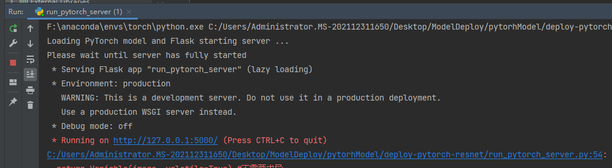
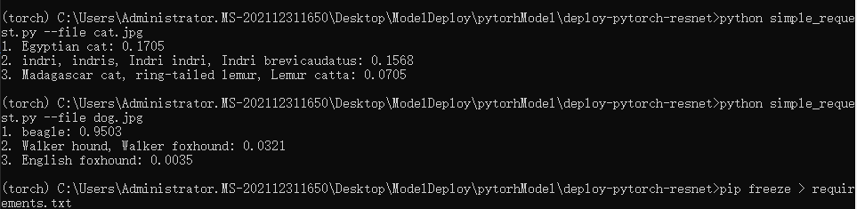

基于flask部署resnet预训练模型


环境需要

```python
pip install requirement.txt
```


测试结果


```python

(torch) C:\Users\Administrator.MS-202112311650\Desktop\ModelDeploy\pytorhModel\deploy-pytorch-resnet>python simple_request.py --file cat.jpg
1. Egyptian cat: 0.1705
2. indri, indris, Indri indri, Indri brevicaudatus: 0.1568
3. Madagascar cat, ring-tailed lemur, Lemur catta: 0.0705

(torch) C:\Users\Administrator.MS-202112311650\Desktop\ModelDeploy\pytorhModel\deploy-pytorch-resnet>python simple_request.py --file dog.jpg
1. beagle: 0.9503
2. Walker hound, Walker foxhound: 0.0321
3. English foxhound: 0.0035
```
两个文件运行结果







